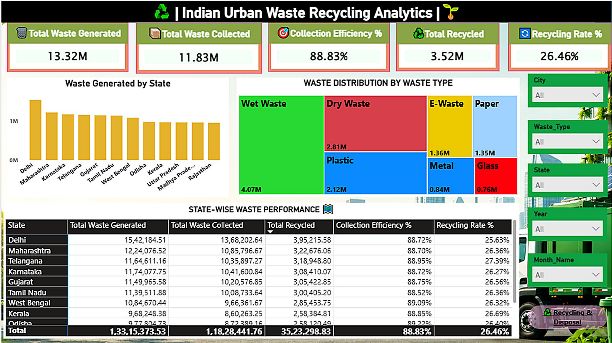
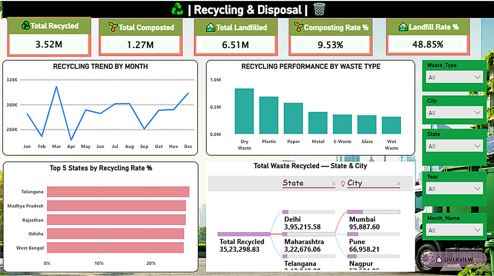

# Indian Urban Waste Recycling Analytics using Power BI

## 📊 Project Overview

Indian Urban Waste Recycling Analytics is an interactive Power BI dashboard designed to analyze urban waste generation, collection, recycling, composting, and landfill performance across India.

The project provides data-driven insights through KPIs, charts, state-wise and city-wise comparisons, waste-type analysis, trends, and interactive filters.

---

## 🎯 Objectives

- Measure total waste generated and collected.
- Analyze recycling and composting performance.
- Track landfill disposal.
- Calculate collection efficiency and recycling rate.
- Compare waste-management performance across states and cities.
- Identify gaps and improvement areas.
- Support data-driven waste-management analysis.

---

## 📂 Dataset

The dataset contains:

- **30,000 records**
- **20 columns**
- State and City information
- Year and Month information
- Waste generation and collection data
- Recycling and composting data
- Landfill disposal data
- Different waste types

### Waste Types

- Wet Waste
- Dry Waste
- Plastic
- Paper
- Metal
- Glass
- E-Waste

---

## 📌 Key KPIs

| KPI | Value |
|---|---:|
| Total Waste Generated | 13.32M |
| Total Waste Collected | 11.83M |
| Total Waste Recycled | 3.52M |
| Total Waste Composted | 1.27M |
| Total Waste Landfilled | 6.51M |
| Collection Efficiency | 88.83% |
| Recycling Rate | 26.46% |
| Composting Rate | 9.53% |
| Landfill Rate | 48.85% |

### KPI Formulas

**Collection Efficiency**

`Collected ÷ Generated × 100`

**Recycling Rate**

`Recycled ÷ Generated × 100`

**Composting Rate**

`Composted ÷ Generated × 100`

**Landfill Rate**

`Landfilled ÷ Generated × 100`

---

## 📊 Dashboard Page 1 — Overview

The Overview dashboard provides an executive view of:

- Total Waste Generated
- Total Waste Collected
- Collection Efficiency
- Total Waste Recycled
- Recycling Rate
- Waste Generated by State
- Waste Distribution by Waste Type
- State-wise Waste Performance

### Interactive Filters

- City
- Waste Type
- State
- Year
- Month



---

## ♻️ Dashboard Page 2 — Recycling & Disposal

The second dashboard provides detailed analysis of:

- Total Recycled
- Total Composted
- Total Landfilled
- Composting Rate
- Landfill Rate
- Recycling Trend by Month
- Recycling Performance by Waste Type
- Top 5 States by Recycling Rate
- Total Waste Recycled by State and City



---

## 🛠️ Tools & Technologies

- Power BI Desktop
- Power Query
- DAX
- Data Cleaning
- Data Transformation
- Data Modeling
- Data Visualization
- Interactive Dashboard Design

---

## 🔄 Project Workflow

```text
Raw Dataset
     ↓
Data Cleaning
     ↓
Data Transformation
     ↓
Data Modeling
     ↓
DAX Measures & KPIs
     ↓
Data Visualization
     ↓
Interactive Power BI Dashboard
     ↓
Insights & Analysis
```

---

## 💡 Key Insights

- Waste generation varies across states and cities.
- Collection efficiency highlights regional performance differences.
- Recycling and composting show waste recovery levels.
- Landfill disposal represents an important waste-management area.
- State and city comparisons provide regional performance insights.
- The dashboard can support better recycling, collection, and disposal planning.

---

## 🎓 Skills Demonstrated

- Power BI Dashboard Development
- Power Query
- DAX
- Data Cleaning & Preparation
- Data Modeling
- Data Visualization
- KPI Development
- Trend Analysis
- Regional Analysis
- Analytical Thinking
- Problem Solving

---

## 📁 Project Structure

```text
Indian-Urban-Waste-Recycling-Analytics-using-Power-BI/
│
├── Indian_Urban_Waste_Recycling_Analytics.csv
├── wast_management.pbix
├── Dashboard_Page_1.png
├── Dashboard_Page_2.png
├── background.jpg
└── README.md
```

---

## 🚀 How to Use

1. Download or clone this repository.
2. Open `wast_management.pbix` using Power BI Desktop.
3. If required, update the dataset source path.
4. Refresh the data.
5. Explore the dashboard using the available filters and visuals.

---

## 🔮 Future Scope

- Real-time waste collection monitoring
- Expansion to more cities and states
- Additional waste categories
- Predictive analytics for waste generation
- Recycling trend forecasting
- Cost analysis
- Environmental impact analysis

---

## 👨‍💻 Author

**Rakesh Dasnor**

MCA | Data Analytics | Power BI | SQL | Python 

---

## ⭐ Project Highlights

- 30,000 Records
- 20 Columns
- 2 Dashboard Pages
- 9 Major KPIs
- State & City Analysis
- Waste Type Analysis
- Recycling Analysis
- Composting Analysis
- Landfill Analysis
- Power Query
- DAX
- Interactive Visualizations

---

## 📌 Conclusion

This project provides a consolidated view of urban waste generation, collection, recycling, composting, and landfill performance using Power BI.

It demonstrates the complete data analytics workflow from data preparation and transformation to KPI development, visualization, dashboard creation, and insight generation.
